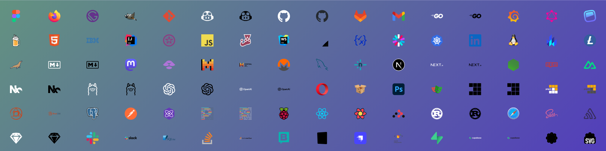

# Personal LinkedIn Banner

Create and download a LinkedIn banner with your favorite engineering SVG logos!

Showcase your skills with a personalized LinkedIn banner featuring your favorite engineering tools. This simple web app lets you select the tools you love and create a custom banner to highlight your expertise. Perfect for developers looking to stand out on LinkedIn and proudly display their skill set.

Visit: <https://plb.exiguus.app/>.

## Features

- Select from a variety of engineering SVG logos
- Customize the layout and design of your banner
- Download your personalized banner in high resolution

## Motivation

I created this project driven by two core motivations:

1. **_Empowering Engineers to Showcase Their Skills_**:
   I wanted to build a tool that helps engineers create LinkedIn banners, making it easier for them to showcase their skills and achievements.
2. **_Pushing the Boundaries of My Technical Abilities_**:
   Dive deeper into the Architecture, Design and Development of Web-Component Applications and Patterns exploring the following technologies:
   - Web-Components with TypeScript and Lit.
   - Vite dev server and build tool.
   - Vitest and @open-wc/testing for component testing.
   - Cypress for end-to-end testing.

## Thanks

Thanks to [svgl](https://github.com/pheralb/svgl) for all the SVG logos.

## License

MIT License
