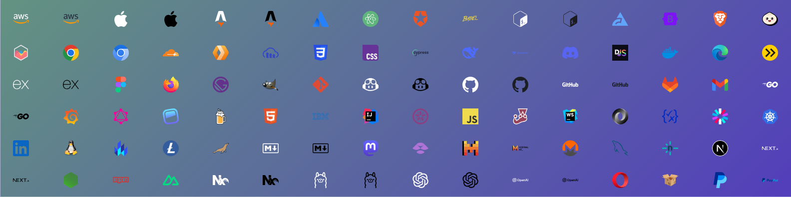

# Personal LinkedIn Banner

Create and download a LinkedIn banner with your favorite engineering SVG logos!

Showcase your skills with a personalized LinkedIn banner featuring your favorite engineering tools. This simple web app lets you select the tools you love and create a custom banner to highlight your expertise. Perfect for developers looking to stand out on LinkedIn and proudly display their skill set.

Visit: <https://plb.exiguus.app/> and download a personalized LinkedIn banner:

## Features

- Select from a variety of engineering SVG logos
- Customize the layout and design of your banner
- Download your personalized banner in high resolution

## Motivation

I created this project driven by two core motivations:

1. **_Empowering Engineers to Showcase Their Skills_**:
   I wanted to build a tool that helps engineers create LinkedIn banners, making it easier for them to showcase their skills and achievements.
2. **_Pushing the Boundaries of My Technical Abilities_**:
   - Web-Components with TypeScript and Lit.
   - Vite dev server and build tool.
   - Vitest and @open-wc/testing for component testing.
   - Cypress for end-to-end testing.

## Development

### Installation

1. Clone the repository.
2. Install dependencies with `pnpm install`.
3. Fetch all needed assets (svgl logos) with `pnpm assets`.
4. Start the development server with `pnpm dev`.
5. Component tests can be run with `pnpm test`.
6. End-to-end tests can be run with `pnpm cy:watch`.

### Testing

- Run component tests with `pnpm test`.
- Before running end-to-end tests, run `pnpm build` to generate the production build and serve it with `pnpm serve`.
- Run end-to-end tests with `pnpm cy:run`.

See [Svgl.md](./Svgl.md) for more information on the asset management and data processing scripts.

## License

MIT License

## Thanks

Thanks to [svgl](https://github) for all the SVG logos.
